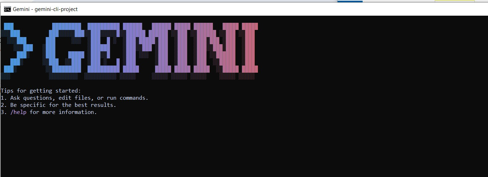

# AI-Driven-Development-day3

## Day 3 🚀

## Task 3

# 🌟 PART A — Research Questions (Short Answers)

## Nine Pillars Understanding

1. **What new improvements were introduced in Gemini 3.0?**

**Answer** : 
             Much stronger reasoning — Gemini 3 has “state-of-the-art” deep thinking, handling complex, multi-step tasks more accurately.Enhanced multimodal understanding — it better integrates text, images, video, audio and code, and supports a huge 1 million-token context window.It is a new AI-powered workspace made for Gemini 3 where the AI can build, test, and run projects by itself.
It works like a smart coding environment where Gemini can plan tasks, write code, fix errors, run commands, and show results — all in one place.

2. **How does Gemini 3.0 improve coding & automation workflows?**

**Answer** : 
         1 -   Gemini 3.0 can plan, write, run, and fix code automatically, reducing manual work.

         2 - It handles larger projects with its big context window, understanding full codebases at once.

         3 -With the new Antigravity IDE, it automates tasks, testing, and file generation to speed up development.

3. **How does Gemini 3.0 improve multimodal understanding?**

**Answer** : 
            **Understands many types of data together** : Gemini 3.0 can read text, view images, watch videos, listen to audio, and analyze code — all at the same time.

**Connects information better** : It can link details from different formats (like matching a description to an image or video clip) more accurately.

**Handles larger inputs**: With its huge context window, it can understand long documents, multiple images, or long videos without forgetting earlier details.

4. **Name any two developer tools introduced with Gemini 3.0.**

**Answer** : 
            **Antigravity IDE** – for autonomous coding, planning, and task execution.

  **Gemini Code Assist** – integrates with platforms like GitHub to help write, debug, and manage code efficiently.

# 🌟 PART B — Practical Task (Screenshot Required)

## Update the Gemini 3.0 model

